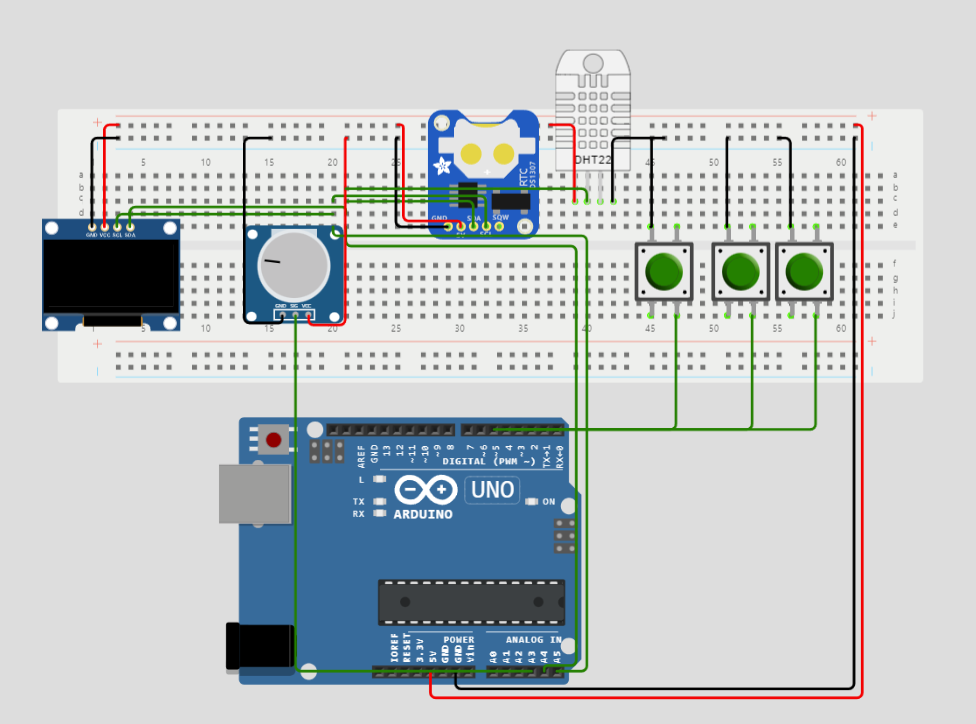

<div id="top"></div>

[![LinkedIn][linkedin-shield]][linkedin-url]


<!-- PROJECT LOGO -->
<br />
<div align="center">
  <a href="https://github.com/othneildrew/Best-README-Template">
    
  </a>

  <h3 align="center">Arduino Zero Time, Date, Humidity, and Temperature Display</h3>

  <p align="center">
    An awesome c++ project to jumpstart your c++/embedded learning journey!
   
</div>


<!-- TABLE OF CONTENTS -->
<details>
  <summary>Table of Contents</summary>
  <ol>
    <li>
      <a href="#about-the-project">About The Project</a>
      <ul>
        <li><a href="#built-with">Built With</a></li>
      </ul>
    </li>
    <li>
      <a href="#getting-started">Getting Started</a>
      <ul>
        <li><a href="#prerequisites">Prerequisites</a></li>
        <li><a href="#circuit-connection">Circuit Connection</a></li>
      </ul>
    </li>
    <li><a href="#usage">Usage</a></li>
    <li><a href="#contributing">Contributing</a></li>
    <li><a href="#contact">Contact</a></li>

  </ol>
</details>


<!-- ABOUT THE PROJECT -->
## About The Project
<div align="center">
 
</div>

This project utilizes the Arduino Zero microcontroller to read and display real-time clock information, humidity, and temperature data on an OLED display. The Arduino Zero is a powerful development board, offering advanced features and a 32-bit core.

By combining the capabilities of the Arduino Zero with a real-time clock (RTC) module and a humidity/temperature sensor (DHT11), this project provides an intuitive interface for monitoring the current time, date, humidity, and temperature. The OLED display enhances the user experience by presenting the information in a clear and visually appealing manner.

<p align="right">(<a href="#top">back to top</a>)</p>


### Built With


* [ARDUINO](https://docs.arduino.cc/)

<p align="right">(<a href="#top">back to top</a>)</p>


<!-- GETTING STARTED -->
## Getting Started

To get a local copy up and running follow these **_simple_** steps.

### Prerequisites

Here is the software & hardware that have been used in this project.

#### Electronics
    1x Arduino ZERO board
    1x USB to Micro-USB cable
    1x Full Breadboard (no less that half-size reccomened)
    1x RTC unit (with battery)
    1x SSD1306 128x64 OLED Display
    1x DHT11 unit
    3x Normal switches
    1x 10K Potentiometer
    25x male-to-male connector wires

#### IDE
I use the arduino IDE 2.1.0 or newer, but any IDE that can compile to arduino will do. 
Download the newest version <a href="https://www.arduino.cc/en/software">here</a> or download <a href="https://downloads.arduino.cc/arduino-ide/arduino-ide_2.1.0_Windows_64bit.exe">2.1.0</a> directly here. 

#### Libraies 
Remember to install all libraries with dependencies.
```cpp
#include <SPI.h>
#include <Wire.h>
#include <Adafruit_GFX.h>
#include <Adafruit_SSD1306.h>
#include "EasyButton.h"
#include "RTClib.h"
#include "DHT.h"
```
<p align="right">(<a href="#top">back to top</a>)</p>


## Circuit Connection


##### OLED
SDA to ZERO SDA


SCL to ZERO SCL 


VCC to 3.3 


GND to GROUND

##### RTC
SDA to ZERO SDA


SCL to ZERO SCL


5V to 3.3 (with the one used for us)


GND to GROUND

##### DHT11
SCL to PIN 2


VCC to 3.3 (with the one used for us)


GND to GROUND

##### BUTTONS
GND to GROUND 


VCC to PIN 8 


GND to GROUND 


VCC to PIN 9 


GND to GROUND 


VCC to PIN 10 

_Note: these pins need to support interrupt_

##### 10K POTENTIOMETER
GND to GROUND


VCC to 3.3


SIGNAL to A4

_Note: this has to be an analog pin_


<p align="right">(<a href="#top">back to top</a>)</p>

<!-- USAGE EXAMPLES -->
## Usage

1. Connect the components as per the provided circuit "diagram".
2. Install the required libraries (RTC Library, DHT Library, OLED Display Library) in the Arduino IDE.
3. Open the Arduino IDE and upload the project code to the Arduino Zero.
4. Once the code is successfully uploaded, the OLED display will start showing the current time, date, humidity, and temperature.

_For other documentation, please refer to the [ARDUINO Documentation](https://www.arduino.cc/reference/en/)_

<p align="right">(<a href="#top">back to top</a>)</p>


<!-- CONTRIBUTING -->
## Contributing

Contributions are what make the open source community such an amazing place to learn, inspire, and create. **Unfortunatly** - This project does not support it yet

####**Honorable mentions goes to:**
<a href="mailto: kris456h@elevcampus.dk">Kristian Solkær Gade Sørensen</a> - For helping solve a for loop problem with a string array.
<a href="mailto: elia1040@elevcampus.dk">Elias Nielsen Andersen</a> - For general support throughout this whole project.
<a href="mailto: thom59w9@elevcampus.dk">Thomas Damkjær</a> - For providing working code for temperature & humidity reading.
 
<p align="right">(<a href="#top">back to top</a>)</p>


<!-- CONTACT -->
## Contact

Kevin Vetter- [@kevin_vetter04](https://twitter.com/kevin_vetter04) -  kevinmvetter@gmail.com

Project Link: Not on GitHub yet.

<p align="right">(<a href="#top">back to top</a>)</p>


[linkedin-shield]: https://img.shields.io/badge/-LinkedIn-black.svg?style=for-the-badge&logo=linkedin&colorB=555
[linkedin-url]: https://www.linkedin.com/in/kevin-vetter-53293321b/
